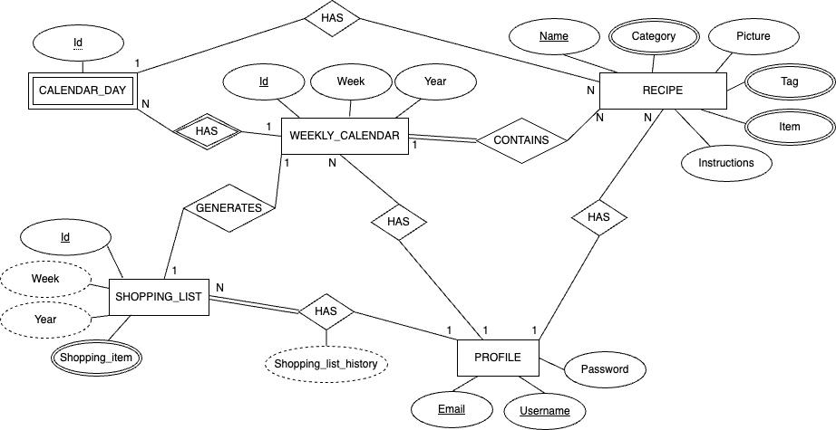

# Backend and Frontend Template

Latest version: https://git.ita.chalmers.se/courses/dit341/group-00-web (public Github [mirror](https://github.com/dit341/group-00-web))

## Project Structure

| File        | Purpose           | What you do?  |
| ------------- | ------------- | ----- |
| `server/` | Backend server code | All your server code |
| [server/README.md](server/README.md) | Everything about the server | **READ ME** carefully! |
| `client/` | Frontend client code | All your client code |
| [client/README.md](client/README.md) | Everything about the client | **READ ME** carefully! |
| [docs/DEPLOYMENT.md](docs/DEPLOYMENT.md) | Free online production deployment | Deploy your app online in production mode |
| [docs/LOCAL_DEPLOYMENT.md](docs/LOCAL_DEPLOYMENT.md) | Local production deployment | Deploy your app local in production mode |

## Requirements

The version numbers in brackets indicate the tested versions but feel free to use more recent versions.
You can also use alternative tools if you know how to configure them (e.g., Firefox instead of Chrome).

* [Git](https://git-scm.com/) (v2) => [installation instructions](https://www.atlassian.com/git/tutorials/install-git)
  * [Add your Git username and set your email](https://docs.gitlab.com/ce/gitlab-basics/start-using-git.html#add-your-git-username-and-set-your-email)
    * `git config --global user.name "YOUR_USERNAME"` => check `git config --global user.name`
    * `git config --global user.email "email@example.com"` => check `git config --global user.email`
  * > **Windows users**: We recommend to use the [Git Bash](https://www.atlassian.com/git/tutorials/git-bash) shell from your Git installation or the Bash shell from the [Windows Subsystem for Linux](https://docs.microsoft.com/en-us/windows/wsl/install-win10) to run all shell commands for this project.
* [Chalmers GitLab](https://git.ita.chalmers.se/) => Login with your **Chalmers CID** choosing "Sign in with" **Chalmers Login**. (contact [support@chalmers.se](mailto:support@chalmers.se) if you don't have one)
  * DIT341 course group: https://git.ita.chalmers.se/courses/dit341
  * [Setup SSH key with Gitlab](https://docs.gitlab.com/ee/ssh/)
    * Create an SSH key pair `ssh-keygen -t ed25519 -C "email@example.com"` (skip if you already have one)
    * Add your public SSH key to your Gitlab profile under https://git.ita.chalmers.se/profile/keys
    * Make sure the email you use to commit is registered under https://git.ita.chalmers.se/profile/emails
  * Checkout the [Backend-Frontend](https://git.ita.chalmers.se/courses/dit341/group-00-web) template `git clone git@git.ita.chalmers.se:courses/dit341/group-00-web.git`
* [Server Requirements](./server/README.md#Requirements)
* [Client Requirements](./client/README.md#Requirements)

## Getting started

```bash
# Clone repository
git clone git@git.ita.chalmers.se:courses/dit341/group-00-web.git

# Change into the directory
cd group-00-web

# Setup backend
cd server && npm install
npm run dev

# Setup frontend
cd client && npm install
npm run serve
```

> Check out the detailed instructions for [backend](./server/README.md) and [frontend](./client/README.md).

## Visual Studio Code (VSCode)

Open the `server` and `client` in separate VSCode workspaces or open the combined [backend-frontend.code-workspace](./backend-frontend.code-workspace). Otherwise, workspace-specific settings don't work properly.

## System Definition (MS0)

### Purpose

**MyNutritionPlanner** allows users to add their favourite recipes, schedule them for each day of the week and put together a shopping list for better and easier grocery shopping. Along with extra features of modifying the shopping list and browsing the history of them.  **MyNutritionPlanner** becomes an irreplaceable food shopping tool that allows users to save time and money while eating favourite home made dishes.


### Pages

* **Welcome:** The page displays welcome message and has two buttons allowing a new user to register and an already existing user to sign in.
* **Registration:** The page prompts the user to fill in three fields (user name, password, confirm password) and the button "Register" (to confirm and complete registration). Upon successful registration the user gets notified about it and prompted to sign in.
* **User home page:** The page contains all the recipes that have been created by the user or notification if no recipes exist, along with the drop-down category search bar and Button to delete all recipes. By clicking on any existing recipe the user gets redirected to the Recipe page.
* **Recipe page:** The page displays the recipe name, image, ingredients and instructions along with buttons to add the recipe to the weekly plan, edit or remove it.
* **Edit recipe:** The page allows the user to modify all the fields of the recipe and save it or cancel the changes.
* **Add recipe:** The page contains the fields that the user can fill in with the contents and quantities of the ingredients and buttons "Add image" (allowing the user to add dish image to the recipe) and "Save" (to save new recipe).
* **All plans:** The page contains all the existing weekly plans or notification message that no plans have been created yet, along with two buttons to add new plans or delete all existing plans. By clicking on one of the existing plans, the user is redirected to the Weekly plan page.
* **Weekly plan:** The page displays all the recipes scheduled for this particular week, each recipe has a button to be removed from the day it has been scheduled to.
* **Shopping lists:** The page contains all the saved shopping lists along with two buttons to add a new shopping list or delete all of them.
* **Shopping list:** The page contains a form where the user can fill the shopping list name, week number and year, along with a list of items and their quantities. ‘Save list’ button allows the user to save the shopping list.
* **Profile:** The page contains information provided by the user upon registration and has buttons "Edit" (allowing the user to change the profile information) and "Save" (to save the changes).


### Entity-Relationship (ER) Diagram



## Teaser


